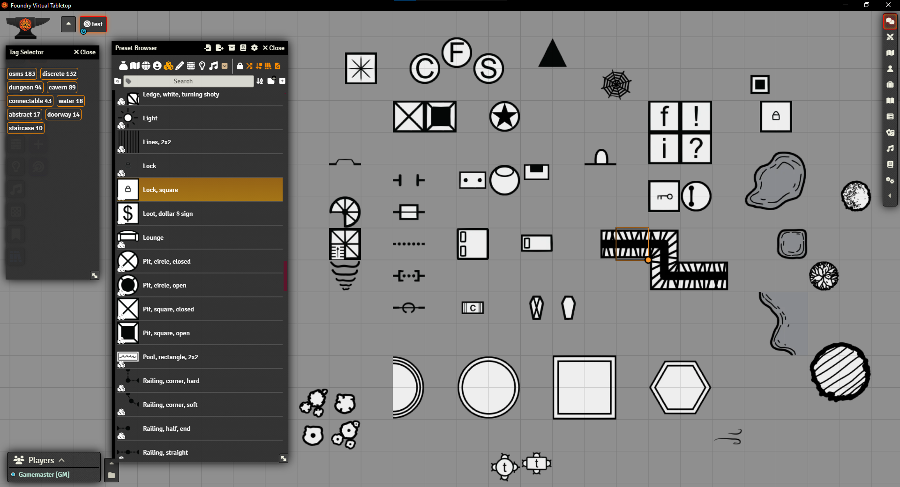
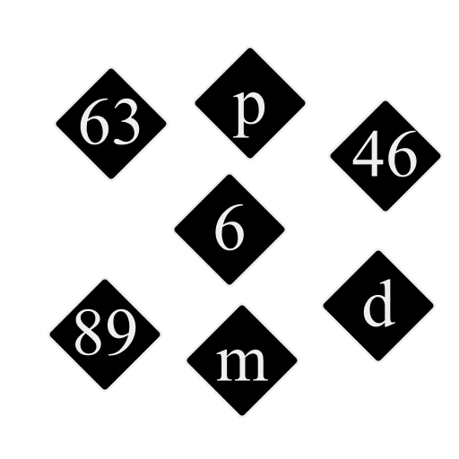

# Old-School Map Symbols Foundry VTT Module

## How to install

* Search for the module in Foundry's *Add-on modules* tab.
* Install manually with this manifest url: https://github.com/Jordan-Abacus/old-school-map-symbols/releases/latest/download/module.json

This module includes old-school map symbols meant to be used as tiles. They are organized and tagged using the Baileywiki Mass Edit module, but are usable without it as regular tiles. All images are webp files sized 100 px per square.

There is also a series of svg images meant to be used for map pins. Numbers 1-99 and letters a-z are included. They are in old-school-map-symbols\artwork\svg

Thank you!

Jordan — [Abacus Tabletop Games](https://abacustabletopgames.bearblog.dev/)

## Dependencies

### Recommended Modules

* [Baileywiki Mass Edit](https://foundryvtt.com/packages/multi-token-edit). The module is used to tag and organize the tiles. They can still be used without.

## Attributions and Thanks

* The tiles are from [Mark Gosbell](https://markgosbell.itch.io/) under a [CC0 license](https://creativecommons.org/publicdomain/zero/1.0/). I modified and adapted some of them and also release them under CC0 license.
* Numbered map pins icons created by using Automatic Journal Icon Numbers, by ChrisF. With permission by the module author. https://foundryvtt.com/packages/journal-icon-numbers

You can find my stuff on my [website](https://abacustabletopgames.bearblog.dev/). If you just want to [pay me a coffee](tab:https://ko-fi.com/abacus_tabletop_games), I thank you!

